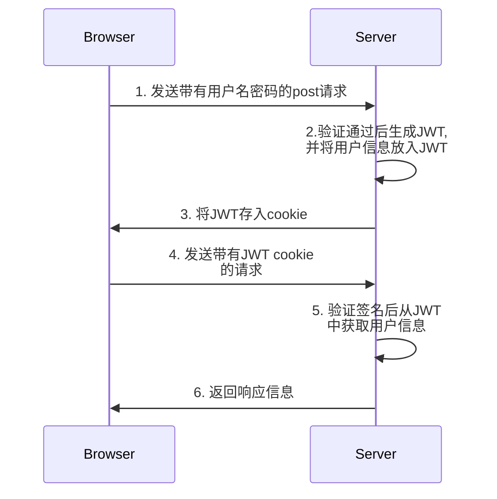

# JWT鉴权模块

	JWT(JSON WEB TOKEN)：JSON网络令牌，JWT是一个轻便的安全跨平台传输格式，定义了一个紧凑的自包含的方式在不同实体之间安全传输信息（JSON格式）。
JWT是在Web环境下两个实体之间传输数据的一项标准。实际上传输的就是一个字符串。
广义上讲JWT是一个标准的名称；狭义上JWT指的就是用来传递的那个token字符串。

## JWT的作用

由于http协议是无状态的，所以可以认为客户端和服务端的所有交互都是新的请求，这就意味着当我们通过账号密码验证用户时，当下一个request请求时它就不会携带刚刚的资料，于是程序只能再次重新识别。
****JWT就是实现了以JSON的格式，在客户端和服务端安全的传输供认证使用的信息***。*

## JWT的结构

由三部分组成，中间用 . 连接

-   头部(header)
-   载荷(payload)
-   签证(signature)

> JWT的官网：[JSON Web Tokens - jwt.io](https://jwt.io/)

## 基于JWT的token身份认证方案

 ****JWT的token身份认证的流程图*

>**服务端验证后，将部分的用户信息存放到JWT中，也就是存在token的字符串中，比如用户的email和用户的姓名等。在鉴权的流程当中，是直接从JWT中直接获取用户信息，这样减少了对Redis缓存组件的依赖，也减少了硬件资源的投入。**

  
  

